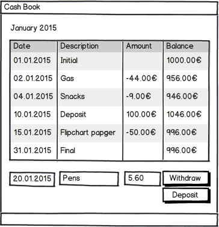

# Cash Book Application

C# implementation for a cash book. Developed incrementally based on Flow Design as described in articles on ["The Architect's Napkin"](http://geekswithblogs.net/theArchitectsNapkin/default.aspx) and/or in [various books](https://leanpub.com/u/ralfw).

Automatic build on AppVeyor: [](https://ci.appveyor.com/project/RalfWestphal/cashbook-incremental)

## Requirements
The cash book application is supposed to help small companies to keep their cash box in order. It's main purpose is to record withdrawals (taking money out of the cash box) and deposits (putting money into the cash box).

A balance sheet shows the transactions in chronological order for each month with initial and finial cash balance.

Transactions can also be exported to a CSV file for further processing with Excel.

Registered transactions cannot be changed, though. Instead a compensating transaction has to be recorded.

Initially the application does not need to be multi-user ready. But a single user should be able to work on centrally located transaction records.

Here's how a user interface for the app could roughly look:



If a transaction is recorded with a date outside the current month, the app should verify this was really intended. Accidental changes to the cash book need to be prevented.

### Interaction Analysis
The app seems to need just one dialog as shown in the above sketch. Users would interact with it in several ways, though.

* Choose a month for the balance sheet to view
* Record a transaction
  * Record a withdrawal
  * Record a deposit
* Export transactions
  * Export the balance sheet shown
  * Export transactions in a specified date range

#### CLI for Interactions
Ultimately the app should sport a graphical user interface. To move the implementation forward as quickly as possible, though, it's easier to start with a Command Line Interface (CLI).

Also a CLI helps focusing on the domain. GUIs can be distracting to developers at times ;-)[^f_CLIvalue]

[^f_CLIvalue]: An app with comprehensive domain logic and "just"" a CLI is (arguably) more valuable than an app with a sophisticated GUI and meager domain logic.

Here's a suggestion for a CLI in action (assume the current year to be 2015):

```
>cb sheet -month:1
January 2015
Date | Description | Amount | Balance
01.  | Initial     |        | 1000.00€
02.  | Gas         | -44.00€|  956.00€
...
31.  | Final       |        |  996.00€
>cb withdraw -d:20.1.2015 -desc:Pens -a:5.60
New balance for January 2015: 990.40€
>cb deposit -d:22.1.2015 -a:100
New balance for January 2015: 1090.40€
>cb withdraw -d:10.12.2014 -desc:Taxi -a:18.50
Cannot record transactions outside the current month. Use -force to overwrite this setting.
>cb withdraw -d:10.12.2014 -desc:Taxi -a:18.50 -force
New balance for December 2014: 981,50€
>cb export -month:1
Exported transactions of January 2015 to cashbook_2015_01.csv
>cb export -year:2014
Exported transactions of 2014 to cashbook_2014.csv
>
```

## Implementation
The implementation separates head from body. The head's sole purpose it to translate between user/environment and body. The body's purpose is to create behavior when triggered by the user through a head.

The head knows the body only via the interface IBody{} defined in a contract assembly. That's simple IoC.

Within the body data is flowing. It's structured according to the IOSP/PoMO principles.

The body is where the action is. It's like the headless horseman in the movie ["Sleepy Hollow"](http://www.imdb.com/title/tt0162661/): very potent without a head.

Initially a CLI head was implemented. It can be exercised through a shell script ([run.sh](https://github.com/ralfw/cashbook_incremental/blob/master/src/cashbook/cashbook.console/run.sh)).

Persistence is achieved using a simple text file based event store.